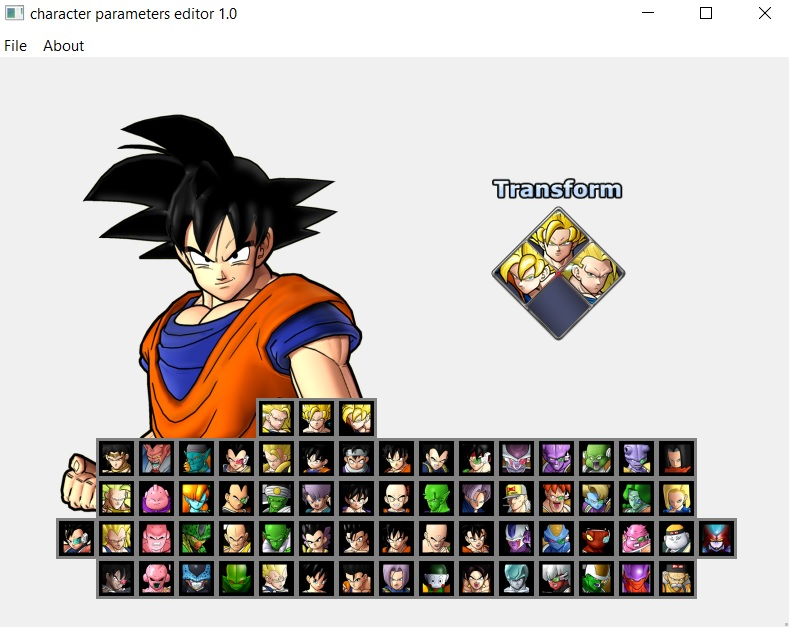
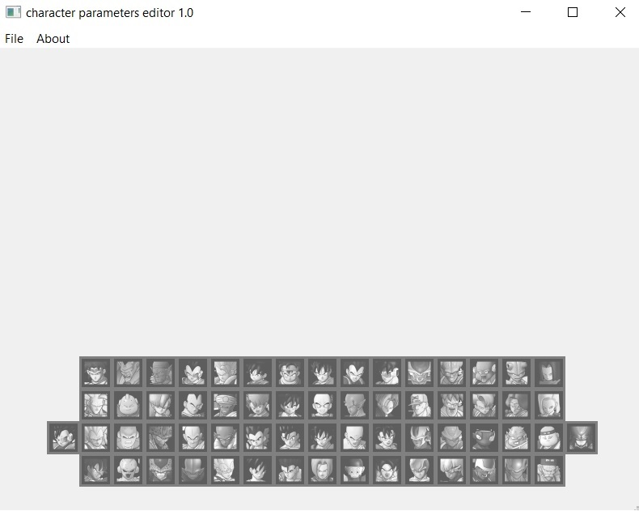
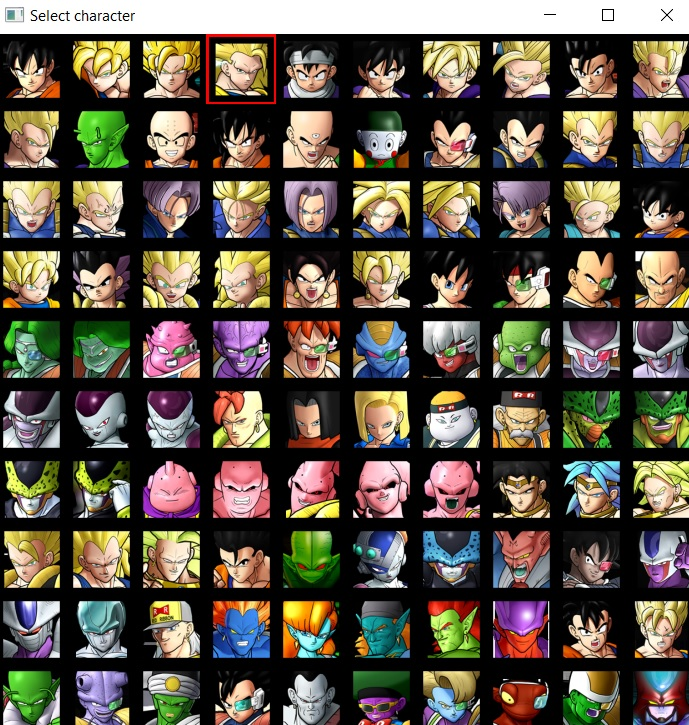
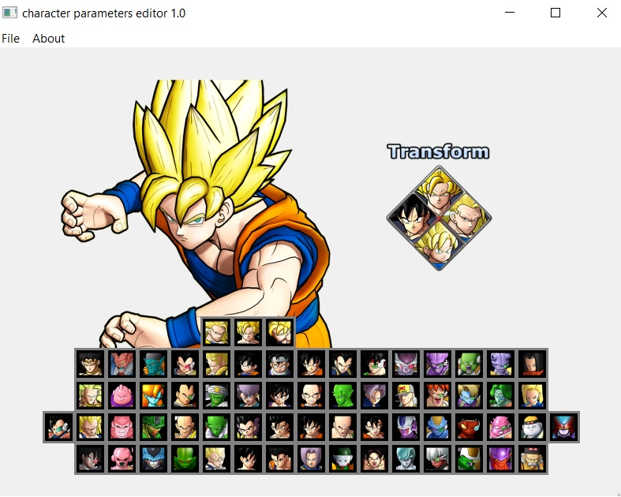

# character_parameters_editor

This tool will help you in the edition of the parameters for the characters like transformations, lightning, glow, etc. The first version will only have transformations, so in the future new features will be added as soon things get discovered.

Credits to the Raging Blast Modding community and specially to revelation from [XeNTaX](https://forum.xentax.com) forum who made the compress/uncompress tool.

You can get access to the Raging Blast Modding community in the [Discord](https://discord.gg/tBmcwkGUE6) server

## How to

When the tool is opened the first time, it will show a disabled panel with all the characters. 

To enable it, you need to open the file operate_resident_param.pak from the st_pack_battle_others_pt_ps3 afs. Doing that, the main panel will be enabled, a portrait of the character selected will be show, and the transformation panel too.

Select the character you want by clicking in his/her image in the panel.

Next, select in the transformation panel the slot you want to edit. It will pop up a new Window with all the character you can swap to.

Click the character you want to add/edit in the slot, and it will be edited for the character. If you want to remove a transformation, select the character that is currently using the slot (character with red border) in order to remove it.

If you finished your editions, confirm the editions by saving the file.